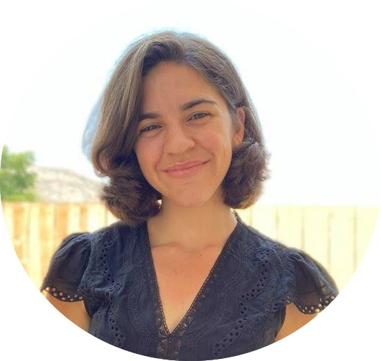

<a href="https://github.com/rpkgarcia">  GitHub</a>
 
 
<a href="https://www.linkedin.com/in/rebecca-kurtz-garcia-ab5bb3ab">  LinkedIn</a>

**Pronouns**: <a href="https://out.ucr.edu/pronouns-matter">she/her</a> 

**Contact:** rkurt001\@ucr.edu 

900 University Ave.   
Olmsted Hall 1108    
Riverside, CA 92521

</a>

# **Biography**

I am a PhD candidate in Applied Statistics at the University of California, Riverside (UCR). Prior to arriving at UCR, I earned a MS in Statistics at Ball State University, and a BS in Statistics at the University of California, Davis. I have worked on a variety of projects related to time series, biostatistics, sports analysis, fiscal policy, and spectral analysis. 
 
 
When I am not working I like to participate in endurance sports, or go rock climbing.  I enjoy sewing dresses for my niece, and love a good book when I have down time.  I have two pets, a dog and a cat.  Some might also consider them statisticians considering how often they like to help me work.
 
 
Some selected projects and course materials may be found under "Projects" and "Teaching", respectively.  Please feel free to contact me for collaboration, mentoring, or consulting work.  

